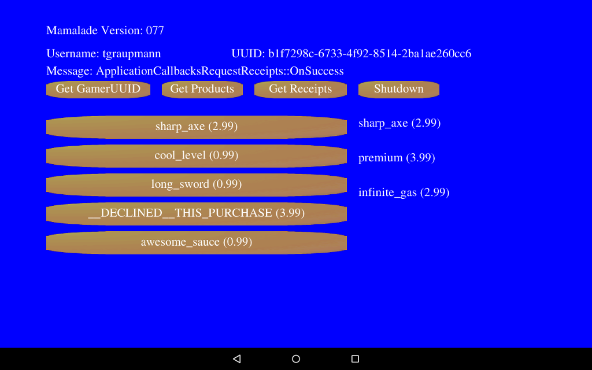

# Marmalade Game Engine

The [RazerSDK](https://github.com/razerofficial/razer-sdk-docs) can be accessed via the `RazerSDK Marmalade Extension`.

## Forums #

* [Forge TV on Razer Forums](https://insider.razerzone.com/index.php?forums/razer-forge-tv.126/)

* [Marmalade Community Answers](https://answers.madewithmarmalade.com/)

### Resources

* Download [Marmalade](https://www.madewithmarmalade.com)

* Download [NVIDIA Codeworks for Android](https://developer.nvidia.com/AndroidWorks)

* Learn [Marmalade](http://developer.madewithmarmalade.com/learn)

* Marmalade [Docs](http://docs.madewithmarmalade.com/)

* Docs: [Project Options](http://docs.madewithmarmalade.com/display/MD/MKB+build+and+project+options)

* Docs: [Resource Management System](http://www.drmop.com/index.php/2011/10/01/marmalade-sdk-tutorial-marmalades-resource-management-system/)

* Docs: [Handling touch events](http://docs.madewithmarmalade.com/display/MD/Detecting+touch,+key+and+accelerometer+inputs)
 
* Docs: [Drawing text](http://docs.madewithmarmalade.com/display/MD/Drawing+text)
 
## Quick Start

* [Buy Marmalade License](https://www.madewithmarmalade.com/shop)

* [Get Marmalade License Key](https://www.madewithmarmalade.com/my-account/licences)

* [Download and install Marmalade](https://www.madewithmarmalade.com/developer)

* Register "Indie" license in the Marmalade HUB

```
C:\Marmalade\8.5\tools\hub2\hub2.exe
```

* Run as administrator:

```
C:\Marmalade\8.5\s3e\bin\s3eConfig.exe
```

* Reboot to have settings take effect.

**Note: Marmalade works best with JDK version 7.**

* Download and install [JDK7](http://www.oracle.com/technetwork/java/javase/downloads/jdk7-downloads-1880260.html)

* Note: The `JAVA_HOME` environment variable should be set to use `JDK7` with the path set to something similar to `c:\NVPACK\jdk1.7.0_71`. Setting `JAVA_HOME` requires a reboot.

## Examples 

### In-App-Purchase Example

The [InAppPurchases](https://github.com/razerofficial/marmalade-plugin-razer-sdk/tree/master/InAppPurchases) sample is a `Marmalade` built and tested with `Visual Studio 2015`.



* Right-click [InAppPurchases.mkb](https://github.com/razerofficial/marmalade-plugin-razer-sdk/blob/master/InAppPurchases/InAppPurchases.mkb) and select `Open with Visual Studio 2015`

(In Visual Studio)

* Switch the `Solution Configuration` to `GCC Arm Debug` or `GCC Arm Release` and build the project

* Build and run the `GCC AARCH64 Debug` which will launch the `Marmalade System Deployment Tool`

(In Marmalade System Deployment Tool)

* Choose `ARM GCC Debug` and click `Next Stage`. Note: Building the `GCC Arm Debug` before launching the deploy tool will make the option available. Close, build, and relaunch the build tool if the option isn't available.
 
* Choose `Android` and click `Next Stage`.
 
* Choose `Android x86+ARM multi-build` and click `Next Stage`.
 
* Select the `Package` option and click `Deploy All`.

(In Explorer)

* Run the [InAppPurchases\debug_install.cmd](https://github.com/razerofficial/marmalade-plugin-razer-sdk/blob/master/InAppPurchases/debug_install.cmd) script.

#### Project Files

InAppPurchases.mkb - The build and deployment configuration, double-click to open Visual Studio

app.icf - Override the default memory limits

Application.h/cpp - Holds an instance of the UI and the method to initialize the plugin

ApplicationCallbacksInitPlugin.h/cpp - Handles callbacks coming from extension to the application with the result of `InitPlugin`

ApplicationCallbacksRequestLogin.h/cpp - Handles callbacks coming from extension to the application with the result of `RequestLogin`

ApplicationCallbacksRequestGamerInfo.h/cpp - Handles callbacks coming from extension to the application with the result of `RequestGamerInfo`

ApplicationCallbacksRequestProducts.h/cpp - Handles callbacks coming from extension to the application with the result of `RequestProducts`

ApplicationCallbacksRequestPurchase.h/cpp - Handles callbacks coming from extension to the application with the result of `RequestPurchase`

ApplicationCallbacksRequestReceipts.h/cpp - Handles callbacks coming from extension to the application with the result of `RequestReceipts`

ApplicationCallbacksShutdown.h/cpp - Handles callbacks coming from extension to the application with the result of `Shutdown`

RazerSDK_ExtensionGamerInfo.h/cpp - A container for the `GamerInfo` about the logged in user

RazerSDK_ExtensionProduct.h/cpp - A container for the `Product` details

RazerSDK_ExtensionPurchaseResult.h/cpp - A container for the `PurchaseResult` identifier

RazerSDK_ExtensionReceipt.h/cpp - A container for the `Receipt` details

Main.cpp - The Application main loop

TextButton.h/cpp - A UI control for displaying text with touch will fire an event

TextLabel.h/cpp - A UI control for displaying text

UI.h/cpp - Displays the user interface and handles invoking the IAP events here

## Razer SDK

The `RazerSDK` can be accessed using the [Marmalade RazerSDK Extension](https://github.com/razerofficial/marmalade-plugin-razer-sdk/tree/master/MarmaladeRazerSDK) which provides access to the `C++ API`.

### Marmalade RazerSDK Extension

The Marmalade RazerSDK Extension is a native wrapper around the RazerSDK which makes the Java library accessible to Marmalade application code.

#### Building the Marmalade Extension

To build the extension from source switch to the extension folder [Marmalade RazerSDK Extension](https://github.com/razerofficial/marmalade-plugin-razer-sdk/tree/master/MarmaladeRazerSDK).

##### Windows

In Windows explorer, right-click [RazerSDK.s4e](https://github.com/razerofficial/marmalade-plugin-razer-sdk/blob/master/MarmaladeRazerSDK/RazerSDK.s4e) and click 'Build Android Extension' in the context menu.

Double-click [RazerSDK_android_java.mkb](https://github.com/razerofficial/marmalade-plugin-razer-sdk/blob/master/MarmaladeRazerSDK/RazerSDK_android_java.mkb) to build the Java source.

Double-click [RazerSDK_android.mkb](https://github.com/razerofficial/marmalade-plugin-razer-sdk/blob/master/MarmaladeRazerSDK/RazerSDK_android.mkb) to build the Native source.

### Using the Marmalade RazerSDK Extension in an Application

Files with the MKB extension define the build and deploy behaviour for Marmalade applications.

Within your Marmalade [application's MKB](https://github.com/razerofficial/marmalade-plugin-razer-sdk/blob/master/InAppPurchases/InAppPurchases.mkb) file, add a subproject for the Marmalade RazerSDK extension.

To reference your local build of the application, specify the relative path the to the extension.

```
subprojects
{
	../MarmaladeRazerSDK/RazerSDK
}
```

Your application needs to include the Marmalade RazerSDK header to interface with the extension.

```
#include "RazerSDK.h"
```

#### Initialization

Before calling the Marmalade RazerSDK extension, an application [main](https://github.com/razerofficial/marmalade-plugin-razer-sdk/blob/master/InAppPurchases/Main.cpp) should check if the extension is available.

```
	if (!RazerSDKAvailable())
	{
		IwTrace(DEFAULT, ("RazerSDK is not available, exit!"));
		return 0;
	}
```

If the Marmalade RazerSDK extension is available, [initialize](https://github.com/razerofficial/marmalade-plugin-razer-sdk/blob/master/InAppPurchases/Application.cpp) with the `Secret API Key` found in the [developer portal](http://devs.ouya.tv).

```
void Application::InitPlugin()
{
	Application::s_ui.SetMessage("Initialize RazerSDK Plugin...");

	string secretApiKey = "eyJkZXZlbG9wZXJfaWQiOiIzMTBhOGY1MS00ZDZlLTRhZTUtYmRhMC1iOTM4";
	secretApiKey += "NzhlNWY1ZDAiLCJkZXZlbG9wZXJfcHVibGljX2tleSI6Ik1JR2ZNQTBHQ1Nx";
	secretApiKey += "R1NJYjNEUUVCQVFVQUE0R05BRENCaVFLQmdRQ3A2VENMYzg1cHBGdnY5U1RU";
	secretApiKey += "Q3pYYk9aYVlDczFDNEdrcHNQMEQwaGs4dkoyZ1pqVjJhNUUwMHVTeVBYN1FO";
	secretApiKey += "cytWMlJIUTVLYkRJYUk3eFArS2JsdkZQK2FzZmdNM0M1aFR1c1F6TUxpVmFX";
	secretApiKey += "R1FVYzBFamF5bzNKZGdSN3lVSE9oWkhMU3dCZ2ZGckxVMU5za3pVdzVFQ3ZU";
	secretApiKey += "TGRDSk85bjdDNHhCcnBkZ25LUUlEQVFBQiJ9";

	Plugin_initPlugin(secretApiKey.c_str(),
		Application::s_ui.m_callbacksInitPlugin->GetSuccessEvent(),
		Application::s_ui.m_callbacksInitPlugin->GetFailureEvent());
}
```

### OnFailure

All `OnFailure` callbacks return an `int errorCode` and `string errorMessage` when used by `RazerSDK` function calls.

### OnCancel

All `OnCancel` callbacks have no parameters when used by `RazerSDK` function calls.

### InitPlugin

See the [RazerSDK Documentation](https://github.com/razerofficial/razer-sdk-docs) for details on how to obtain the `Secret API Key`.

The `Plugin_initPlugin` function takes a `const char*` parameter for the `SecretApiKey`. The second parameter takes a pointer to a `s3eCallback` success event. The third parameter takes a pointer to a `s3eCallback` failure event. The success callback is invoked if the `RazerSDK` is initialized successfully. The failure callback is invoked if the `RazerSDK` fails to initialize. The success event is invoked after IAP has been initialized.

```
	string secretApiKey = "eyJkZXZlbG9wZXJfaWQiOiIzMTBhOGY1MS00ZDZlLTRhZTUtYmRhMC1iOTM4";
	secretApiKey += "NzhlNWY1ZDAiLCJkZXZlbG9wZXJfcHVibGljX2tleSI6Ik1JR2ZNQTBHQ1Nx";
	secretApiKey += "R1NJYjNEUUVCQVFVQUE0R05BRENCaVFLQmdRQ3A2VENMYzg1cHBGdnY5U1RU";
	secretApiKey += "Q3pYYk9aYVlDczFDNEdrcHNQMEQwaGs4dkoyZ1pqVjJhNUUwMHVTeVBYN1FO";
	secretApiKey += "cytWMlJIUTVLYkRJYUk3eFArS2JsdkZQK2FzZmdNM0M1aFR1c1F6TUxpVmFX";
	secretApiKey += "R1FVYzBFamF5bzNKZGdSN3lVSE9oWkhMU3dCZ2ZGckxVMU5za3pVdzVFQ3ZU";
	secretApiKey += "TGRDSk85bjdDNHhCcnBkZ25LUUlEQVFBQiJ9";

	Plugin_initPlugin(secretApiKey.c_str(),
		Application::s_ui.m_callbacksInitPlugin->GetSuccessEvent(),
		Application::s_ui.m_callbacksInitPlugin->GetFailureEvent());
```

### RequestLogin

`Plugin_requestLogin` opens the login dialog to sign in the user. This method should only be invoked after the `RazerSDK` has successfully initialized.  The first parameter takes a pointer to a `s3eCallback` success event. The second parameter takes a pointer to a `s3eCallback` failure event. The third parameter takes a pointer to a `s3eCallback` cancel event. The success callback is invoked if the operation completes successfully. The failure callback is invoked if the operation failed. The cancel callback is invoked if the operation was canceled. The `s3eRequestLoginSuccessEvent` event indicates the user has signed in or the user was already signed in. The `s3eRequestLoginFailureEvent` event indicates there was a problem signing in. The `s3eRequestLoginCancelEvent` event indicates that the user canceled signing in.   

The success event indicates success which indicates the user is logged in.

The failure event indicates a problem with error code and error message.

The cancel event indicates the user canceled the sign in process.

Invoking `Plugin_requestLogin` takes the success, failure, and cancel event callbacks.

```
	Plugin_requestLogin(
		Application::s_ui.m_callbacksRequestLogin->GetSuccessEvent(),
		Application::s_ui.m_callbacksRequestLogin->GetFailureEvent(),
		Application::s_ui.m_callbacksRequestLogin->GetCancelEvent());
```

When the Marmalade RazerSDK has completed RequestLogin, it invokes the Application callback for onSuccess, onFailure, or onCancel.

The success callback indicates sign in completed successfully, which is passed to the UI.

```
	void ApplicationCallbacksRequestLogin::OnSuccess()
```

The failure callback passes an error code and string message about the failure, which is passed to the UI.

```
	void ApplicationCallbacksRequestLogin::OnFailure(int errorCode, const string& errorMessage)
```

The error callback indicates the user aborted the operation and the event name is passed to the UI.

```
	void ApplicationCallbacksRequestLogin::OnCancel()
```

### RequestGamerInfo

`Plugin_requestGamerInfo` returns the `GamerInfo` for the logged in user. This method should only be invoked after the `RazerSDK` has successfully initialized.  The first parameter takes a pointer to a `s3eCallback` success event. The second parameter takes a pointer to a `s3eCallback` failure event. The third parameter takes a pointer to a `s3eCallback` cancel event. The success callback is invoked if the operation completes successfully. The failure callback is invoked if the operation failed. The cancel callback is invoked if the operation was canceled. The `s3eRequestGamerInfoSuccessEvent` event receives a `RazerSDK::GamerInfo` object.


The `RazerSDK::GamerInfo` object provides the `Username` and `Uuid` fields.

```
	class GamerInfo
	{
	public:
		string Username;
		string Uuid;
	};
```

The success event indicates success which also provides the gamer info.

The failure event indicates a problem with error code and error message. The failure event will fire if the user is not logged in.

The cancel event indicates the user canceled the request.

Invoking `Plugin_requestGamerInfo` takes the success, failure, and cancel event callbacks.

```
	Plugin_requestGamerInfo(
		Application::s_ui.m_callbacksRequestGamerInfo->GetSuccessEvent(),
		Application::s_ui.m_callbacksRequestGamerInfo->GetFailureEvent(),
		Application::s_ui.m_callbacksRequestGamerInfo->GetCancelEvent());
```

When the Marmalade RazerSDK has completed RequestGamerInfo, it invokes the Application callback for onSuccess, onFailure, or onCancel.

The success callback passes the gamer info, which is passed to the UI.

```
	void ApplicationCallbacksRequestGamerInfo::OnSuccess(const GamerInfo& gamerInfo)
```

The failure callback passes an error code and string message about the failure, which is passed to the UI.

```
	void ApplicationCallbacksRequestGamerInfo::OnFailure(int errorCode, const string& errorMessage)
```

The error callback indicates the user aborted the operation and the event name is passed to the UI.

```
	void ApplicationCallbacksRequestGamerInfo::OnCancel()
```

### RequestProducts

`Plugin_requestProducts` returns the product information given a `const char*` json array of `identifiers`. This method should only be invoked after the `RazerSDK` has successfully initialized. The `identifiers` can be `ENTITLEMENTS` and/or `CONSUMABLES`.

The `RazerSDK::Product` object provides the `Identifier`, `Name`, `Description`, `Local Price`, `Product Type` and several other fields.

```
	class Product
	{
	public:
		string CurrencyCode;
		string Description;
		string DeveloperName;
		string Identifier;
		float LocalPrice;
		string Name;
		float OriginalPrice;
		float PercentOff;
		int PriceInCents;
		string ProductType;
	};
```

Pass an array of JSON to the Marmalade RazerSDK Extension to get the details of the product list and invoke the callbacks upon completion.

```
	// prepare json
	int jsonArray = Plugin_JSONArray_Construct();

	int index = 0;
	for (vector<string>::iterator iter = m_productIds.begin(); iter != m_productIds.end(); ++iter)
	{
		string identifier = *iter;
		Plugin_JSONArray_PutString(jsonArray, index, identifier.c_str());
		++index;
	}

	string productsJson = Plugin_JSONArray_ToString(jsonArray);

	Plugin_requestProducts(productsJson.c_str(),
		Application::s_ui.m_callbacksRequestProducts->GetSuccessEvent(),
		Application::s_ui.m_callbacksRequestProducts->GetFailureEvent(),
		Application::s_ui.m_callbacksRequestProducts->GetCancelEvent());
```

The success callback passes the retrieved product list, which is passed to the UI.

```
void ApplicationCallbacksRequestProducts::OnSuccess(const vector<Product>& products)
```

The failure callback passes an error code and string message about the failure, which is passed to the UI.

```
void ApplicationCallbacksRequestProducts::OnFailure(int errorCode, const string& errorMessage)
```

The error callback indicates the user aborted the operation and the event name is passed to the UI.

```
void ApplicationCallbacksRequestProducts::OnCancel()
```

### RequestPurchase

`Plugin_requestPurchase` initiates a purchase for the logged in user given the `identifier` and `product type`. The `product type` can be `ENTITLEMENT` or `CONSUMABLE`. This method should only be invoked after the `RazerSDK` has successfully initialized. Entitlements and consumables need to correspond to the items that were created in the [developer portal](https://devs.ouya.tv). The failure event will fire if the user is not logged in.

The `RazerSDK::PurchaseResult` object provides the `Identifier` that was just purchased by the logged in user.

```
	class PurchaseResult
	{
	public:
		string Identifier;
	};
```

Invoke the Marmalade RazerSDK Extension to request purchase for the identifier and invoke the callbacks upon completion.

```
	string identifier = "long_sword";

	// purchase an entitlement
	string productType = "ENTITLEMENT";
	Plugin_requestPurchase(identifier.c_str(),
		productType.c_str(),
		Application::s_ui.m_callbacksRequestPurchase->GetSuccessEvent(),
		Application::s_ui.m_callbacksRequestPurchase->GetFailureEvent(),
		Application::s_ui.m_callbacksRequestPurchase->GetCancelEvent());

	// purchase a consumable
	string productType = "CONSUMABLE";
	Plugin_requestPurchase(identifier.c_str(),
		productType.c_str(),
		Application::s_ui.m_callbacksRequestPurchase->GetSuccessEvent(),
		Application::s_ui.m_callbacksRequestPurchase->GetFailureEvent(),
		Application::s_ui.m_callbacksRequestPurchase->GetCancelEvent());
```

The success callback passes the purchased product details, which is passed to the UI.

```
void ApplicationCallbacksRequestPurchase::OnSuccess(const ApplicationProduct& product)
```

The failure callback passes an error code and string message about the failure, which is passed to the UI.

```
void ApplicationCallbacksRequestPurchase::OnFailure(int errorCode, const string& errorMessage)
```

The error callback indicates the user aborted the operation and the event name is passed to the UI.

```
void ApplicationCallbacksRequestPurchase::OnCancel()
```

### RequestReceipts

`Plugin_requestReceipts` returns all the `ENTITLEMENT` receipts for the logged in user. This method should only be invoked after the `RazerSDK` has successfully initialized. The failure event will fire if the user is not logged in.

The `RazerSDK::Receipt` object provides the `Identifier`, `LocalPrice`, and several other fields.

```
	class Receipt
	{
	public:
		string Currency;
		string GamerUuid;
		string GeneratedDate;
		string Identifier;
		float LocalPrice;
		int PriceInCents;
		string PurchaseDate;
		string Uuid;
	};
```

Invoke the Marmalade RazerSDK Extension to request purchase for the identifier and invoke the callbacks upon completion.

```
	Plugin_requestReceipts(
		Application::s_ui.m_callbacksRequestReceipts->GetSuccessEvent(),
		Application::s_ui.m_callbacksRequestReceipts->GetFailureEvent(),
		Application::s_ui.m_callbacksRequestReceipts->GetCancelEvent());
```

The success callback passes the purchased product details, which is passed to the UI.

```
void ApplicationCallbacksRequestReceipts::OnSuccess(const vector<Receipt>& receipts)
```

The failure callback passes an error code and string message about the failure, which is passed to the UI.

```
void ApplicationCallbacksRequestReceipts::OnFailure(int errorCode, const string& errorMessage)
```

The error callback indicates the user aborted the operation and the event name is passed to the UI.

```
void ApplicationCallbacksRequestReceipts::OnCancel()
```

### Shutdown

This method should only be invoked after the `RazerSDK` has successfully initialized. The `RazerSDK` must be shutdown before exiting the application. 

```
	Plugin_shutdown(
		Application::s_ui.m_callbacksShutdown->GetSuccessEvent(),
		Application::s_ui.m_callbacksShutdown->GetFailureEvent(),
		Application::s_ui.m_callbacksShutdown->GetCancelEvent());
```

The success callback indicates the application is ready to exit.

```
void ApplicationCallbacksShutdown::OnSuccess()
```

The failure callback passes an error code and string message about the failure, which is passed to the UI.

```
void ApplicationCallbacksShutdown::OnFailure(int errorCode, const string& errorMessage)
```

### Quit

This method should only be invoked after the `RazerSDK` has been shutdown if the `RazerSDK` had successfully initialized. The `s3eDeviceRequestQuit` function will signal the main loop to exit the application.

```
	s3eDeviceRequestQuit();
```
